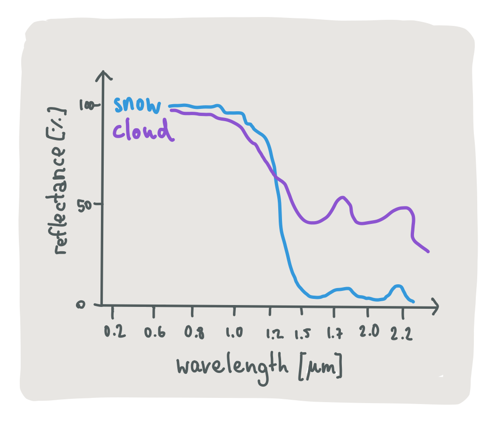
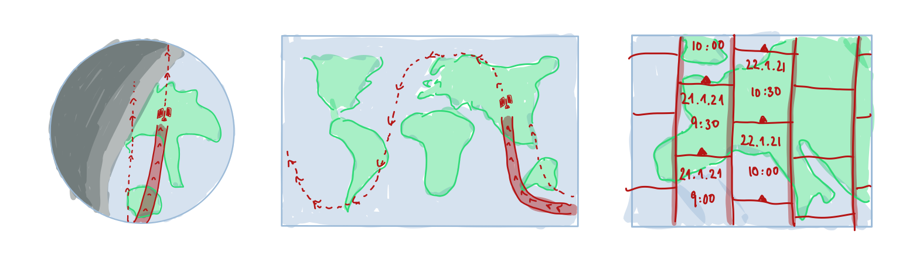
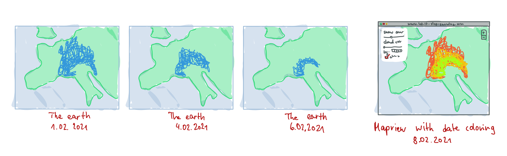

# How does it work?

## Detecting snow from space

The snow cover we show on the map is calculated from two satellites from the european Copernicus 
program, named [Sentinal 2a and 2b](https://sentinel.esa.int/web/sentinel/missions/sentinel-2).
They record images of the earth's surface as they are orbiting our planet in a height of 786km.
These images allow us to determine the surface snow cover with a very high resolution: The satellites can measure each 
20x20m patch individually, which is much better than only using the weather stations at the ground (in Germany there are ~800 [todo -> to resolution]).

Actually, it is not straightforward to tell directly from the satellite image whether snow occupies such a small patch or not.
In the image of the Alps below, a white area could be both snow or clouds.
Zooming in, you could even mistake buildings or rock formations for snow because of their white coloring.
On the contrary, old snow gets darker and mushier, but it still is snow.

What is helpful to detect the snow is that the satellites do not only record the light reflected from the earths surface that is
visible to the human eye.
They additionally capture higher and lower wave lengths, and snow and clouds reflect different kinds of wave lengths with different strengths, which 
makes their light reflection profiles differ [cite the reviwe paper https://www.tandfonline.com/doi/full/10.1080/01431161.2011.640964].

Since these profiles differ depending on the age of the snow, its temperature, the dust in the air or the humidity of a cloud, 
it is not trivial to tell
snow surfaces apart from other surfaces even if we have access to the complete profile.
More advanced methods work better ... machine learning.
In our case, we use the [snow product](https://land.copernicus.eu/user-corner/technical-library/hrsi-snow-pum) directly provided by the  E.U. Copernicus Land Service Information.
It uses the algorithm developed by  ... that works like ....
Finally, when clouds are occluding the surface area below them, we can no longer detect snow in these areas.
This is why we allow you to also view when we detected clouds in a satellite image - to be informed that the lack of snow 
is not due to being sure that there is no snow, but because we detected a cloud and cannot see below it.

## Creating satellite imagery

In order to use this map properly it is helpful to understand how the satellite imagery is generated.
Although the map is presented as a 'whole', it is actually made up of many small image tiles that were taken each at a different
time.
So what you see is a mosaic of snapshots of several moments rather than a snapshot of the whole earth at the same time.
This has several reasons: Firstly, the sentinel satellites require sunlight to take images, so even if they had the possibility
to take an image of the whole earth at once, about half of it would be useless (the part where it is night ...).
Secondly, the satellites can only capture images in only a small range around them, so they have to orbit the earth 
several times (and with a fixed speed) until they have seen the whole world once. 
For one sentinel satellite this orbit takes 4 days. Having two of them up in the air, we get an image of every 
place on earth about every two days.
You can see exemplary orbits in the image below and also flight over times for the satellite for different of the image tiles
that make up the mosaic.

This kind of time independent tiling can lead to some effects that may seem unintuitive at the first view, e.g. snow areas that
are cut off by a straight line that crosses straight over the length of Germany. The simple explanation is that
the snow melted in the time it took to capture the neighbouring areas.
Also, this could happen if there were some clouds that occluded the surface. 
The example below shows how the images of 3 days would be combined into one snow cover map given what the earth 
looked like at that moment in time.
To give you more control over this, we let you decide on your own how many of the last days you would like to view on 
the map and show on which days the snow was actually observed on hovering over the map.

As the atmosphere is rarely cloud free, especially when it is snowing and prevents us from detecting snow at all, we show the last 14
days by default for an overview.
In this time, each area is covered by 7 satellite overflights which hopefully includes a cloud free day.
As the predicted snow cover is simply aggregated on top of one another and can lead to misleading conclusions, we allow you to 
enable the date coloring and see directly how old each detected patch of snow is.

## I don't care about snow, can I use the project to serve other geo data online?

Contact us at mail@fancydomain.com to discuss if our solution fits your needs.

## References

- Inspired by: www.theia-land.fr
